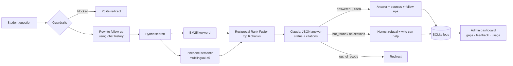

# 🧭 Campus Copilot

**Cited answers to NIT Rourkela rules, straight from official documents, and an honest "I don't know" when the answer isn't there.**

🔗 **Live demo:** [add Streamlit link] · 📄 **[Product spec (PRD)](docs/PRD.md)** · 🎥 **[2-min walkthrough](add Loom link)**

<!-- Add 2 screenshots here: a cited answer, and the admin content-gaps view -->

---

## The problem

Rules that decide whether a student can sit an exam, change branch, or register on time are buried in 30-page PDFs and yearly notices on nitrkl.ac.in. Students ask seniors or WhatsApp groups instead, and get answers that are often outdated. When the cost of a wrong answer is a missed exam, a chatbot that *sounds* confident is dangerous. This one is built to be **trustworthy first**.

## What it does

**For students**
- Ask in plain English, Hindi, or Odia; get a short answer with **the document and page it came from**, linked to the official PDF
- Follow-up questions work in context ("what about for dual degree?")
- Filter by topic: academics, exams, fees, hostel, placements, scholarships
- When the documents don't cover it: says so and tells you **which office can help**
- Suggested follow-ups and 👍/👎 feedback on every answer

**For admins**
- Usage dashboard: questions, answer rate, helpfulness, latency, topic mix
- **Content gaps:** unanswered questions ranked by demand, so you know which document to add next
- 👎 review queue with student comments
- Upload documents and re-index from the browser
- Every metric shows the SQL behind it

**For quality**
- Evaluation harness with a labelled golden set: retrieval hit rate, answer correctness (LLM judge), refusal accuracy, p50/p95 latency
- Offline test suite with Claude mocked, run in CI on every push

## How it works



**Design choices that matter** (full reasoning in the [PRD](docs/PRD.md#7-key-decisions-and-trade-offs)):
- **Hybrid retrieval.** Students type exact terms ("CGPA", "Autumn 2026-27") *and* paraphrases. Keyword search catches the first, embeddings the second; RRF combines them without tuning.
- **Structured output with an explicit `not_found` state.** This one field powers escalation, content-gap analytics, and refusal evaluation.
- **No citation, no answer.** If Claude answers without citing a retrieved document, the answer is automatically downgraded to "not found".
- **Provider-agnostic model layer.** Gemini, Groq, OpenRouter or Claude behind one interface, chosen in `.env`. The eval set makes swapping models a measured decision rather than a guess.
- **Runs on ₹0.** Free Gemini tier for generation and embeddings, a local NumPy vector index instead of a hosted vector database, free hosting. No credit card anywhere. Pinecone stays available behind the same interface if the corpus outgrows one file.

## Evaluation

<!-- Paste eval/results/latest.md here after running the eval -->

| Metric | Result | Target |
|---|---|---|
| Retrieval hit rate@6 | _run eval_ | ≥ 95% |
| Answer correctness | _run eval_ | ≥ 90% |
| Refusal accuracy | _run eval_ | ≥ 90% |
| p95 latency | _run eval_ | ≤ 6 s |

The golden set (`eval/golden_set.jsonl`) includes answerable questions, questions the documents don't cover, out-of-scope requests, a Hindi question, and a prompt-injection attempt.

## What it costs to run

| Piece | Choice | Cost |
|---|---|---|
| Answer + judge model | Gemini Flash-Lite / Flash, free tier | ₹0, no credit card |
| Embeddings | `gemini-embedding-001`, free tier | ₹0 |
| Vector index | Local NumPy file in the repo | ₹0 |
| Keyword index | BM25, runs locally | ₹0 |
| Analytics | SQLite | ₹0 |
| Hosting | Streamlit Community Cloud | ₹0 |

Free tiers are rate limited (roughly 10 requests/minute, 1,000/day at the time of writing), which is fine for a pilot. The ingestion script paces its embedding calls, and the provider layer backs off and retries on 429s.

## Run it locally

```bash
git clone https://github.com/<you>/campus-copilot && cd campus-copilot
python -m venv .venv && source .venv/bin/activate   # Windows: .venv\Scripts\activate
pip install -r requirements.txt
cp .env.example .env                                 # add GEMINI_API_KEY (free, no card)

python scripts/fetch_documents.py                    # download starter official PDFs
python scripts/ingest.py                             # chunk + index
streamlit run app.py                                 # open http://localhost:8501

python eval/run_eval.py                              # quality report → eval/results/latest.md
python -m pytest -q                                  # offline tests, no keys needed
```

## Deploy (free) on Streamlit Community Cloud

1. Run `fetch_documents.py` and `ingest.py` locally, then commit `data/raw/`, `data/index/chunks.json` and `data/index/vectors.npz`.
2. Push to GitHub, go to share.streamlit.io, and create an app from `app.py`.
3. In **Settings → Secrets** add:
   ```toml
   LLM_PROVIDER = "gemini"
   GEMINI_API_KEY = "..."
   ADMIN_PASSWORD = "something-strong"
   ```
4. Free-tier keys are rate limited rather than billed, so a public link cannot run up a bill. Note that Google may use free-tier prompts to improve its products; everything indexed here is a public institute document, and no student data is collected.

## Project structure

```
app.py                    Student chat UI
pages/1_Admin.py          Usage, content gaps, feedback, documents, eval results
core/ingest.py            PDF loading, cleaning, paragraph-aware chunking with page metadata
core/retriever.py         BM25 + Pinecone hybrid retrieval with RRF
core/llm.py               Prompts, query rewriting, grounded answers, eval judge
core/providers.py         One HTTP layer for Gemini / Groq / OpenRouter / Claude
core/vectorstore.py       Free embeddings + local NumPy vector index (Pinecone optional)
core/rag.py               Pipeline: guardrails → retrieve → answer → escalate → log
core/db.py                SQLite schema + analytics SQL
scripts/                  fetch_documents.py, ingest.py
eval/                     golden_set.jsonl, run_eval.py, results/
docs/PRD.md               Problem, users, metrics, decisions, risks, rollout
tests/                    Offline tests (Claude mocked)
```

## Roadmap

- Freshness warnings when a cited calendar or notice is from a past academic year
- WhatsApp / Telegram interface
- Scheduled scraper for new notices on nitrkl.ac.in
- Postgres for durable analytics; per-session rate limiting

## Disclaimer

A student-built project, not an official NIT Rourkela service. Always confirm deadlines and fee-related rules on nitrkl.ac.in.
